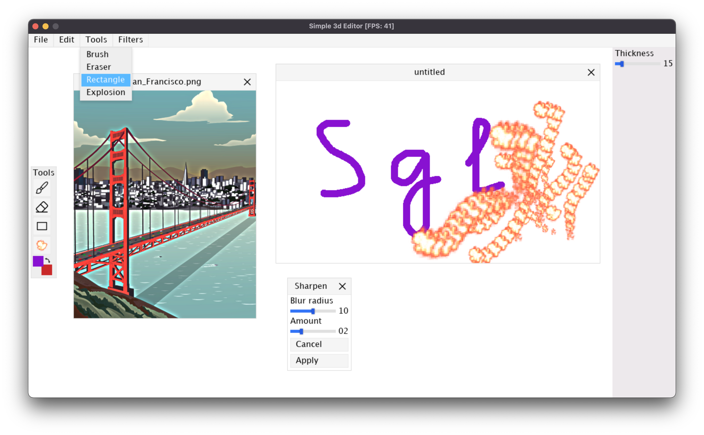
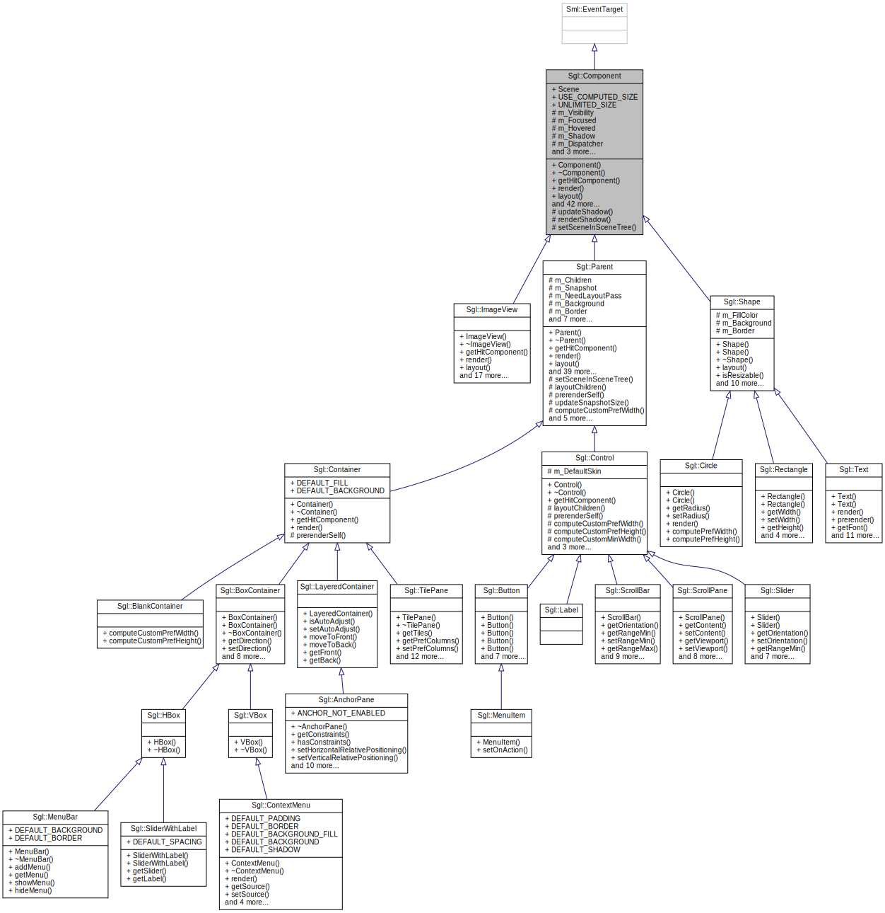
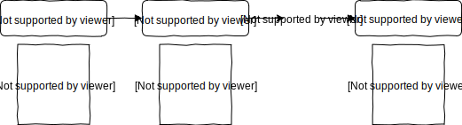
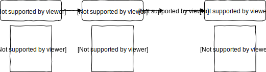

# Simple GUI Library
Cross-platform GUI library, which is highly influenced by qt and javafx architectures.


*The picture is taken from [simple-3d-editor](https://github.com/tralf-strues/simple-3d-editor).*

## Installation
The install script will create a directory sgl/, which will contain all header files and the static library sgl.a, in the directory specified by OutputPrefix.

```Shell
$ git clone https://github.com/tralf-strues/simple-gui-library.git
$ cd simple-gui-library
$ make install OutputPrefix=<YOUR DIRECTORY HERE>
```

## Overview
The library uses my [simple-multimedia-library](https://github.com/tralf-strues/simple-multimedia-library). Components render themselves to sml's `Texture`, the event system uses sml's `Event` and event-dispatching (though highly modified version of it) and so on.

### Scene components
A `Scene` is basically a hierarchical tree of gui `Component`s. This hierarchy is used for things like rendering, layout management, event dispatching, etc. Below is the inheritance diagram of gui components.



#### Shapes
Shapes are components (mostly of geometrical nature) which are not resizable and allow setting `Background` and `Border` attributes that define the way they are being rendered.

The list of shapes includes
* `Circle`
* `Rectangle`
* `Text`

#### Containers
Containers can store any number of components and layout them in some specific (to this exact container) way.

The list of containers includes
* `BoxContainer` places components in one line, either horizontal or vertical.
  * `HBox`
  * `VBox`
* `LayeredContainer` provides with the ability to specify the layer for components.
  * `AnchorPane` allows anchoring components to the borders of the container.
* `TilePane` lays out the components in a fixed-size tiles, kind of in a table-like way.

#### Controls
Controls are components that allow user-interaction and delegate some functionality to `Skin`s.

The list of controls includes
* `Button`
* `ScrollBar`
* `Slider`
* `ScrollPane`

### Event system
Each component is an `EventTarget`. The event processing is split into several stages

1. **Creating `GuiEvent`**
   
   In most cases, this is done internally by the system. The system registers a system event (e.g. `MouseMoved`, `KeyPressed`, etc.).
2. **Determining the `EventTarget`**
   
   The system determines to which component the event should be sent. Some examples include:
   * A keyboard event is sent to the currently focused component. 
   * A mouse event is sent to the component on which the cursor is pointed.
3. **Building a `GuiEventDispatchChain` from event target**
4. **Capturing phase**
   
   The next stage is moving the event from the root to the target. Each component has its own `GuiEventDispatcher` which calls filters on the event. A filter can consume the event and then the dispatching process terminates (though all of the current dispatcher's filters are called nonetheless).

   

5. **Bubbling phase**
   
   The next stage is moving the event from the target to the root. Here each dispatcher calls handlers on the event. A handler can consume the event and then the dispatching process terminates (though all of the current dispatcher's handlers are called nonetheless). Most target components consume the event and the bubbling phase doesn't occur.

   
